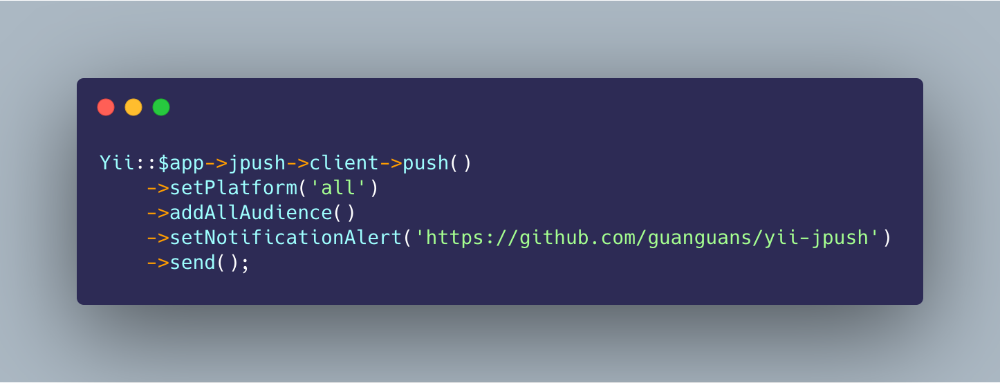

<h1 align="center">yii-jpush</h1>

<p align="center">适配于 Yii 的极光扩展包</p>

<p align="center"></p>

[](https://travis-ci.org/guanguans/yii-jpush)
[](https://scrutinizer-ci.com/g/guanguans/yii-jpush/build-status/master)
[](https://scrutinizer-ci.com/g/guanguans/yii-jpush/?branch=master)
[](https://github.styleci.io/repos/258963285)
[](https://packagist.org/packages/guanguans/yii-jpush)
[](https://packagist.org/packages/guanguans/yii-jpush)
[](https://packagist.org/packages/guanguans/yii-jpush)

## 环境要求

* yii >= 2

## 安装

``` shell
$ composer require guanguans/yii-jpush -v
```

## 配置

Yii2 配置文件 `config/main.php` 的 components 中添加:

``` php
'components' => [
	// ...
	'jpush' => [
        'class' => 'Guanguans\YiiJpush\Jpush',
        'appKey' => 'xxxxxxxxxxx',
        'masterSecret' => 'xxxxxxxxxxx',
    ],
	// ...
]
```

## 使用，更多详细文档请参考 [jpush/jpush-api-php-client](https://github.com/jpush/jpush-api-php-client)

### 获取 `JPush\Client` 实例

``` php
<php
Yii::$app->jpush->client
```

### 简单使用

``` php
<?php
Yii::$app->jpush->client->push()
    ->setPlatform('all')
    ->addAllAudience()
    ->setNotificationAlert('Hello, JPush')
    ->send();
```

### 异常处理

``` php
<?php
$pusher = Yii::$app->jpush->client->push();
$pusher->setPlatform('all');
$pusher->addAllAudience();
$pusher->setNotificationAlert('Hello, JPush');
try {
    $pusher->send();
} catch (\Exception $e) {
    // try something else here
    echo $e;
}
```

## 测试

``` shell
$ composer test
```

## License

[MIT](LICENSE)